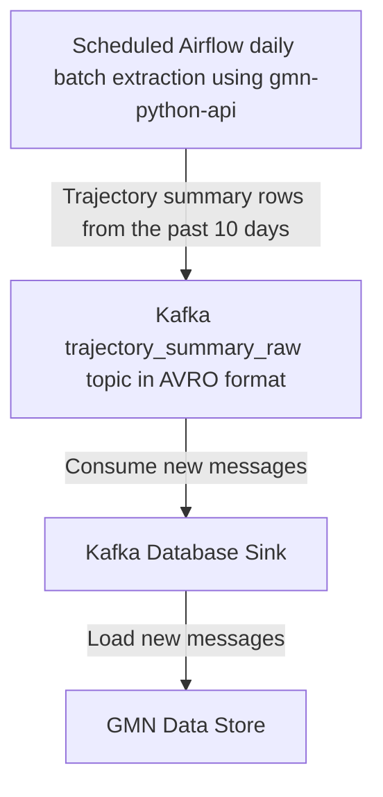

# GMN Data Store Ingestion
Global Meteor Network ingestion services for the [GMN Data Store](https://github.com/gmn-data-platform/gmn-data-store).

This project provides data infrastructure services for extracting GMN data from sources and transforming/loading the data into the [GMN Data Store](https://github.com/gmn-data-platform/gmn-data-store).

Data flow diagram:


Services provided:
- **Trajectory Summary Batch Extraction** using [Airflow](https://airflow.apache.org/) (web interface `http://0.0.0.0:8080`). Airflow is a workflow management platform for data pipelines, it schedules and monitors data extraction tasks into [Kafka](https://kafka.apache.org/). This service uses the [gmn-python-api](https://github.com/gmn-data-platform/gmn-python-api) package to extract the last 10 days of produced [trajectory summary daily CSV files](https://globalmeteornetwork.org/data/traj_summary_data/daily/) at 1:00 every morning. Once extracted each row in each trajectory summary file is pushed to a Kafka broker in the topic `trajectory_summary_raw`. Each message/trajectory summary row is formatted using the gmn-python-api to conform to the topic's registered [AVRO](https://avro.apache.org/docs/current/) schema in the [Kafka Schema Registry](https://docs.confluent.io/platform/current/schema-registry/index.html). Another [DAG](https://airflow.apache.org/docs/apache-airflow/stable/concepts/dags.html) is also provided that extracts the [total trajectory summary file](https://globalmeteornetwork.org/data/traj_summary_data/traj_summary_all.txt) from the data directory and pushes all rows to the `trajectory_summary_raw` topic. This is a manually run task and should be used for initial or historical trajectory summary data ingestion.
- A **Kafka Broker** (`http://localhost:9092`) for streaming meteor trajectory data after being extracted. The `trajectory_summary_raw` topic stores rows extracted from the trajectory summary CSV files in the GMN data directory. Messages in this topic are serialised using [AVRO](https://avro.apache.org/docs/current/spec.html). The [gmn-python-api](https://github.com/gmn-data-platform/gmn-python-api) package is used to provide the [AVSC](https://avro.apache.org/docs/current/spec.html) schema in the [Kafka Schema registry](https://docs.confluent.io/platform/current/schema-registry/index.html) for this topic. Messages in this topic must conform to the [gmn-python-api data schema](https://gmn-python-api.readthedocs.io/en/latest/data_schemas.html). The gmn-python-api package also creates serialised messages for this topic using the schema.
- **Kafka Database Sink** consumes `trajectory_summary_raw` Kafka messages, deserializes the AVRO messages and loads the meteor trajectory rows into the GMN Data Store database using the `gmn-data-store` Python package. Inserts are idempotent so messages that have a matching meteor id will be updated instead of inserted. This means that data in the GMN Data Store can be later updated if data changes in the GMN data directory after initial ingestion. Note that the `gmn_data_store` [Docker Volume](https://github.com/gmn-data-platform/gmn-data-store) should be created before running this.

These services can be started up using the [Makefile](https://github.com/gmn-data-platform/gmn-data-store-ingestion/blob/main/Makefile).

In the future, the GMN will write directly to the `trajectory_summary_raw` topic instead of producing CSV files first. This would allow real-time streaming instead of batch processing for GMN meteor trajectory data. The system has been designed to handle real-time streaming.

More info: https://github.com/gmn-data-platform/gmn-data-platform

## Requirements
| Prerequisite                                                      | Description                                             |
|-------------------------------------------------------------------|---------------------------------------------------------|
| [Docker](https://www.docker.com/)                                 | Container management tool                               |
| [Docker Compose v2](https://docs.docker.com/compose/cli-command/) | A tool for defining multi-container apps                |
| [GNU Make 4.1+](https://www.gnu.org/software/make/)               | A tool which allows an easy way to run project commands |

## Usage
```sh
make init_all_services
make run_all_services
```

See the Makefile for more provided tasks.

## Contributing

Contributions are very welcome.
To learn more, see the [Contributor Guide](https://github.com/gmn-data-platform/gmn-data-store-ingestion/blob/main/CONTRIBUTING.rst).

## License

Distributed under the terms of the [MIT license](https://opensource.org/licenses/MIT), GMN Data Store Ingestion is free and open source software.

## Issues

If you encounter any problems, please [file an issue](https://github.com/gmn-data-platform/gmn-data-store-ingestion/issues) along with a detailed description.
